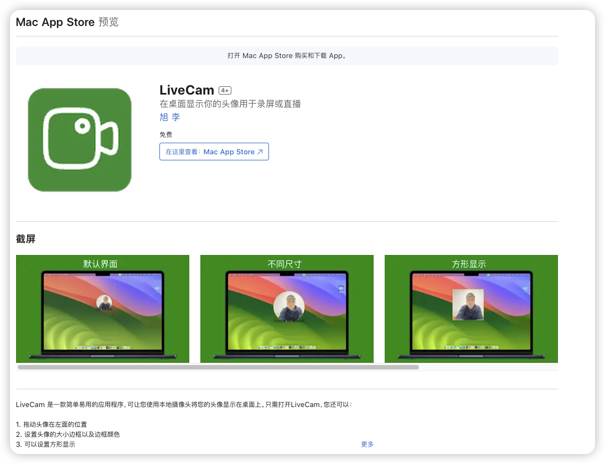

# LiveCam

视频录像或直播头像
### 主界面


### 配置
可以配置大小、边框、形状等参数


# 技术栈

Tauri + Vue 3 + TypeScript


# 使用

## 下载

### MacOS App store [下载](https://apps.apple.com/cn/app/livecam/id6476108478?mt=12)




### window 和 Linux

在 [release](https://github.com/wflixu/icamera/releases) 页面下载


## 本地构建

本地构建

```shell
# 安装依赖
pnpm install
# 构建
pnpm run tb

```