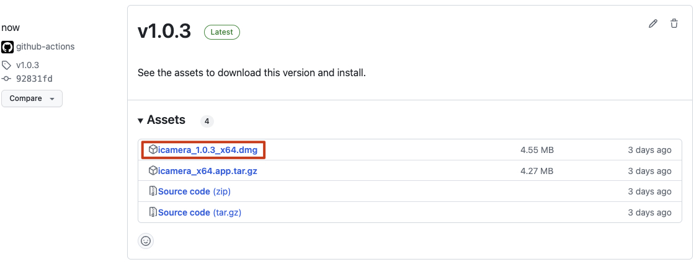
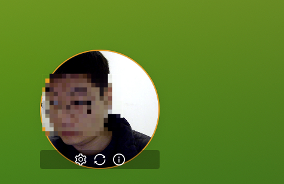
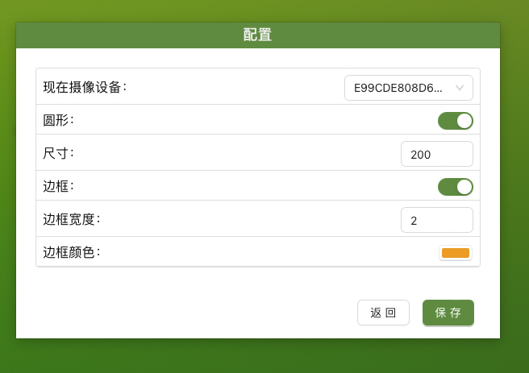

# LiveCam

视频录像或直播头像

Tauri + Vue 3 + TypeScript


# Download

### MacOS App store 
[](https://apps.apple.com/cn/app/livecam/id6476108478?mt=12)


### window 和 Linux

Navigate to the  [release](https://github.com/wflixu/icamera/releases)  page and select the installer that matches your platform.





# Document
### 主界面


### 配置
可以配置大小、边框、形状等参数




# 本地构建

本地构建

```shell
# 安装依赖
pnpm install
# 构建
pnpm run tb

```